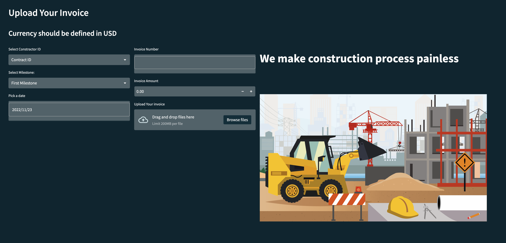
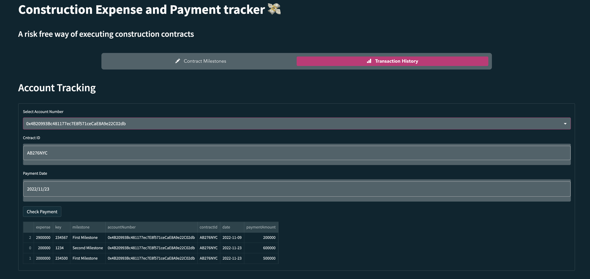
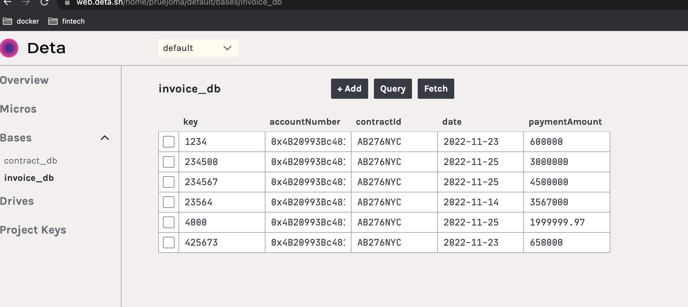

# Construction Contract Payments and Milestones Tracking App

## Table of Contents

 1. Project Motivation
 2. About the Application
 3. Techologies Used
 4. Directory and files
 5. How to run
 6. License
 

----------------------------

##  Project Motivation

This project is in completion of the Columbia University FinTech 2022 bootcamp final project requirements.


## About the Application

Using a well defined User Interface, contractors, can upload invoices for payments, contact project supervisor when milestones are reached, check when/if invoice was/are paid, and auditor/supervisor can approve and pay raised invoices.


## Technologies Used

The application is written in python, with streamlit as one major framework. Data is persisted in nosql databases using Deta - a free cloud database and object store application. 

## Directory and files
- images
- style
- app.py
- etc

## How to run
```
clone this repo
cd construction_contracts_app
set up an env (python environment)
python3 -m pip install -r requirements.txt
on the web navigate to deta.sh
create an account
create a key
set the key in constants.py file
add an email address to constants.py INVOICE_FORM var
streamlit run app.py

new google chrome window will open
```

---
1. Upload invoice


2. Track Payment



3. Invoice db (Deta)



## License
This project is in completion of the Columbia University FinTech 2022 bootcamp final project exercise. It should not be copied and used for commercial purpose without the authorization of the admin of this repo. For futher information please contact Patrick via email on pruejoma@gmail.com